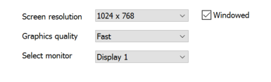
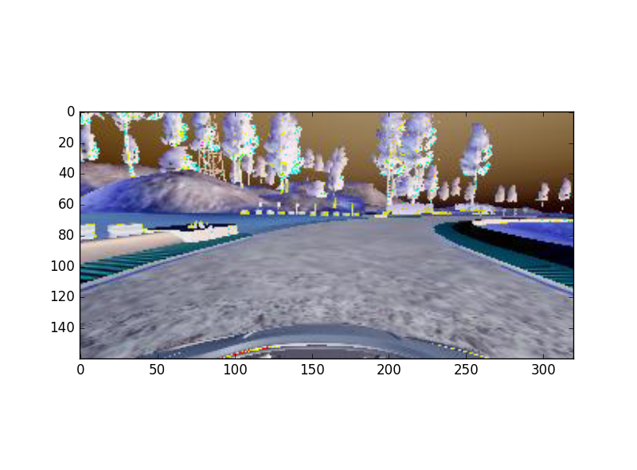
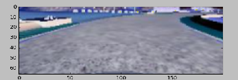

# Behavioral_Cloning

## Introduction

The goal of the project is to performs behavioral cloning, which involves training an deep neural network to mimic human driving behavior in a simulator by predicting Steering Angles from Camera Images.

### Simulator
Training data was generated using the beta simulator for this project. Beta simulator uses the mice to drive the car around track providing more smoother angles than the Stable simulator which uses Keyboard as input device. Most of the training was done with this settings on a Windows 10 Laptop with i7 process, with multiple settings screen/graphics quality to get best result. (sample settings here). 



Autonomous run was done and recorded on the follow settings, on a Windows 10, I7 computer (HP Envy x360):


### Data collection
Training data was collected by a manually driving around a track in the simulator. To train car to move away from the sides during autonomous mode and stay in middle of the lane and also avoid overfitting: explicit recording of pulling back into the middle of the lane was performed both from left, right and on deep curves. Model was then trained on data collected using the vehicle's camera images collected from the manual demonstration. The final trained model is tested against the same test track by driving the car on autonomous mode. 

Skicit learn train_test_split was used to split the data into training and validation at 80% to 20% respectively. And were shuffled for better training fit and  reduce bias.

#### Project Dependency
*	Udacity behavioral cloning simulator
*	AWS GPU (and CPU pc) used for training 
*	Carnd-Term1 requirements such as:
    *	Python 3.5
    *	TensorFlow
    *	Keras
    *	PIL
    *	Numpy
    *	h5py
    *	Scikit Learn

#### Submission
* model.py – This has both LENET^ and NVIDIA* model. It can run both based on the inputs key (lenet or nvidia)
	* *https://images.nvidia.com/content/tegra/automotive/images/2016/solutions/pdf/end-to-end-dl-using-px.pdf
	* ^http://yann.lecun.com/exdb/publis/pdf/lecun-01a.pdf
	<code>
	*	Run:  python model.py lenet  [or]  python model.py nvidia
*	drive.py - The script to load the trained model, interface with the simulator, and drive the car
	*	Run: python driver.py <nvidia/lenet>_model.h5
*	<nvidia/lenet>_model.h5 - The model weights
	*	myutils.py – utility methods
	</code>
### Data Processing

##### Images processing and normalization

Images were cropped to retain only the area of interest by removing top portion (up to middle of the image) and bottom (very close to hood of the car) areas and primarily have only the road/lane section. 
###### Full Image

###### Cropped Image


Images were then resized to 200*66 and then input into the deep learning model. On the deep learning model the first learn is Normalization which reduces the scale from 0 – 255 to -0.5 – 0.5 using Lambda layer.

Images are then changed to COLOR_RGB2YUV mode, for better performance.

###### Angles

Moving average where n=3 was performed to smooth out the angles.

### Model Architecture

The project was coded and test against two architectural models. One based on the Nvidia paper* and other based on LeNet^ model.
Models were run upto 20 Epcohs and dropout was used and final value was set at 0.2 after trying out 0.5, 0.4. Batch size was set to a standard at 128. 

The inital training was done on AWS GPU system but later ran on Intel i7 Cpus due to cost constraints.

Both model were trained with *Generators* to perform and utilize optional memory. Keras.fit_generator was fed by batch function that looped throught data continously and provided batchs of 128 image,angle set to the model. Thus, only a portion entire training and validation set were stored in memory, and the images themselves were read from disk only when new batch was requested.

Intially I have used Relu activation, but later changed it to ELU activation between layers on the both the CNN models. (based on few reference including: http://www.picalike.com/blog/2015/11/28/relu-was-yesterday-tomorrow-comes-elu/ )

Adam optimizer was used to minimize the mean squared error (MSE) with learning rate of 0.001. The loss function was MSE because predicting steering angles is a regression problem.

##### My model based on Nvidia
```
____________________________________________________________________________________________________
Layer (type)                     Output Shape          Param #     Connected to
====================================================================================================
lambda_1 (Lambda)                (None, 66, 200, 3)    0           lambda_input_1[0][0]
____________________________________________________________________________________________________
convolution2d_1 (Convolution2D)  (None, 31, 98, 24)    1824        lambda_1[0][0]
____________________________________________________________________________________________________
convolution2d_2 (Convolution2D)  (None, 14, 47, 36)    21636       convolution2d_1[0][0]
____________________________________________________________________________________________________
convolution2d_3 (Convolution2D)  (None, 5, 22, 48)     43248       convolution2d_2[0][0]
____________________________________________________________________________________________________
convolution2d_4 (Convolution2D)  (None, 3, 20, 64)     27712       convolution2d_3[0][0]
____________________________________________________________________________________________________
convolution2d_5 (Convolution2D)  (None, 1, 18, 64)     36928       convolution2d_4[0][0]
____________________________________________________________________________________________________
dropout_1 (Dropout)              (None, 1, 18, 64)     0           convolution2d_5[0][0]
____________________________________________________________________________________________________
flatten_1 (Flatten)              (None, 1152)          0           dropout_1[0][0]
____________________________________________________________________________________________________
dense_1 (Dense)                  (None, 100)           115300      flatten_1[0][0]
____________________________________________________________________________________________________
dense_2 (Dense)                  (None, 50)            5050        dense_1[0][0]
____________________________________________________________________________________________________
dense_3 (Dense)                  (None, 10)            510         dense_2[0][0]
____________________________________________________________________________________________________
dense_4 (Dense)                  (None, 1)             11          dense_3[0][0]
====================================================================================================
Total params: 252,219
Trainable params: 252,219
Non-trainable params: 0
```
##### My Model based on LeNet:
```
____________________________________________________________________________________________________
Layer (type)                     Output Shape          Param #     Connected to
====================================================================================================
lambda_1 (Lambda)                (None, 66, 200, 3)    0           lambda_input_1[0][0]
____________________________________________________________________________________________________
convolution2d_1 (Convolution2D)  (None, 64, 198, 32)   896         lambda_1[0][0]
____________________________________________________________________________________________________
maxpooling2d_1 (MaxPooling2D)    (None, 32, 99, 32)    0           convolution2d_1[0][0]
____________________________________________________________________________________________________
dropout_1 (Dropout)              (None, 32, 99, 32)    0           maxpooling2d_1[0][0]
____________________________________________________________________________________________________
activation_1 (Activation)        (None, 32, 99, 32)    0           dropout_1[0][0]
____________________________________________________________________________________________________
convolution2d_2 (Convolution2D)  (None, 30, 97, 32)    9248        activation_1[0][0]
____________________________________________________________________________________________________
maxpooling2d_2 (MaxPooling2D)    (None, 15, 48, 32)    0           convolution2d_2[0][0]
____________________________________________________________________________________________________
dropout_2 (Dropout)              (None, 15, 48, 32)    0           maxpooling2d_2[0][0]
____________________________________________________________________________________________________
activation_2 (Activation)        (None, 15, 48, 32)    0           dropout_2[0][0]
____________________________________________________________________________________________________
flatten_1 (Flatten)              (None, 23040)         0           activation_2[0][0]
____________________________________________________________________________________________________
dense_1 (Dense)                  (None, 128)           2949248     flatten_1[0][0]
____________________________________________________________________________________________________
activation_3 (Activation)        (None, 128)           0           dense_1[0][0]
____________________________________________________________________________________________________
dense_2 (Dense)                  (None, 43)            5547        activation_3[0][0]
____________________________________________________________________________________________________
activation_4 (Activation)        (None, 43)            0           dense_2[0][0]
____________________________________________________________________________________________________
dense_3 (Dense)                  (None, 10)            440         activation_4[0][0]
____________________________________________________________________________________________________
dense_4 (Dense)                  (None, 1)             11          dense_3[0][0]
====================================================================================================
Total params: 2,965,390
Trainable params: 2,965,390
Non-trainable params: 0
```


#### Future work and potential enhancements/experiments will be carried out for better smooth driving on the autonmous mode. Including 
* Generating mode training dataset.
* Using better input controller for smoother angles and/or explicit methods to smooth the angles
* Implementing more regularization, data generation with trasformation, deeper understading and implementation of the Nvidia's model
* Also try fine-tuning the later base convolution layers; Test different hyper-parameters, such as learning rate, dropout probability, steering angle offsets, etc.
* work on totally new CNN architecture based on other image vision papers


