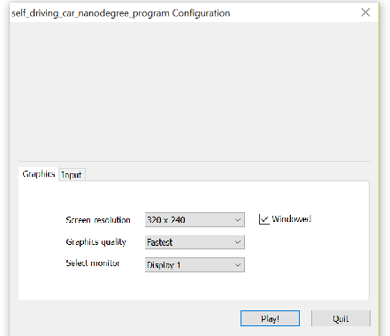
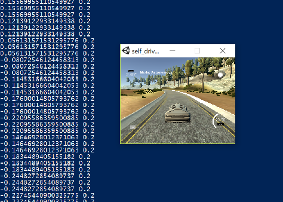

# Behavioral_Cloning

## Introduction

The goal of the project is to performs behavioral cloning, which involves training an deep neural network to mimic human driving behavior in a simulator by predicting Steering Angles from Camera Images.

Simulation Result Recording: https://youtu.be/jDEm-47VnUE

(Video.py output using new driver): https://youtu.be/409SvJ9mZM0   

### Simulator
Training data was generated using the beta simulator for this project. Beta simulator uses the mice to drive the car around track providing more smoother angles than the Stable simulator which uses Keyboard as input device. Most of the training was done with this settings on a Windows 10 Laptop with i7 process, with multiple settings screen/graphics quality to get best result. (sample settings here). 


Autonomous run was done and recorded on the follow settings, on a Windows 10, I7 computer (HP Envy x360):




### Data collection
Training data was collected by a manually driving around a track in the simulator. To train car to move away from the sides during autonomous mode and stay in middle of the lane and also avoid overfitting: explicit recording of pulling back into the middle of the lane was performed both from left, right and on deep curves. Model was then trained on data collected using the vehicle's camera images collected from the manual demonstration. The final trained model is tested against the same test track by driving the car on autonomous mode. 

Skicit learn train_test_split was used to split the data into training and validation at 80% to 20% respectively. And were shuffled for better training fit and  reduce bias.

#### Project Dependency
*	Udacity behavioral cloning simulator
*	AWS GPU (and CPU pc) used for training 
*	Carnd-Term1 requirements such as:
    *	Python 3.5
    *	TensorFlow
    *	Keras
    *	PIL
    *	Numpy
    *	h5py
    *	Scikit Learn

#### Code and Running

	* model.py – This has both LENET^ and NVIDIA* model. It can run both based on the inputs key (lenet or nvidia)
	* *https://images.nvidia.com/content/tegra/automotive/images/2016/solutions/pdf/end-to-end-dl-using-px.pdf
	* ^http://yann.lecun.com/exdb/publis/pdf/lecun-01a.pdf
	*	New Training:  python model.py lenet  [or]  python model.py nvidia
	*	Re-Train or Traing more:  python model.py mode-file.h5
	*	drive.py - The script to load the trained model, interface with the simulator, and drive the car
	*	Run: python driver.py (nvidia/lenet)_model.h5
	*	(nvidia/lenet)_model.h5 - The model weights
	*	myutils.py – utility methods
	
### Data Processing

##### Images processing and normalization

Images were cropped to retain only the area of interest by removing top portion (up to middle of the image) and bottom (very close to hood of the car) areas and primarily have only the road/lane section. 

###### Full Image

###### Cropped Image


I played with image crop and resizing, but finally used the Keras on model cropping for better performance and cleaner code.
         Cropping2D(cropping=((50,20), (0,0))  (See line line 89 on model.py)

###### Preprocessing and Normalization 
On the deep learning model the first learn is Normalization which reduces the scale by 255 – 0.5 using Lambda layer. This was implemented on the myutils.py on the method normalize_grayscale().

For the LEFT and RIGHT images from the camera, an angle correction of +/-0.2 was used.

Translation function was used to augment the steering angles and images randomly and avoid overfitting. Similarly brightness augmentation was performed on the dataset randomly.  Please note both of these was done a only certain amount of the datasets, and I used different percentage of data set to this transformation. It was controled by simple a IF clause:
 	<code>if(np.random.random()<.19)</code>

Images were also subjected to random flips. Where the angles was negated and images was flipped using numpy's _fliplr_ method.
if(np.random.random()<.19):
    
~~Images are then changed to COLOR_RGB2YUV mode, for better performance.~~ This was later dropped due no much performance gain.

### Model Architecture

The project was coded and test against two architectural models. One based on the Nvidia paper* and other based on LeNet^ model.

###### Note that Nvidia architectural model was choosen as it trained better (more complex design) and it has been used for the final work and for all project submission.

Models were run upto 25 Epcohs and dropout was used and final value was set at 0.3 after trying out 0.5, 0.4. Batch size was set to a standard at 64 (but also tried 128). However, I used Keras callbacks EarlyStopping (with different patience settings) and ModelCheckpoint, which was useful in exiting the training if there was no substantial improvements. 

The inital training was done on AWS GPU system but later ran on Intel i7 Cpus due to cost constraints.

Both model were trained with *Generators* to perform and utilize optional memory. Keras.fit_generator was fed by batch function that looped throught data continously and provided batchs of 128 image,angle set to the model. Thus, only a portion entire training and validation set were stored in memory, and the images themselves were read from disk only when new batch was requested.

Intially I have used Relu activation, but later changed it to ELU activation between layers on the both the CNN models. (based on few reference including: http://www.picalike.com/blog/2015/11/28/relu-was-yesterday-tomorrow-comes-elu/ )

Adam optimizer was used to minimize the mean squared error (MSE) with learning rate of 0.001. The loss function was MSE because predicting steering angles is a regression problem.

##### My model based on Nvidia
```
____________________________________________________________________________________________________
Layer (type)                     Output Shape          Param #     Connected to
====================================================================================================
cropping2d_1 (Cropping2D)        (None, 90, 320, 3)    0           cropping2d_input_1[0][0]
____________________________________________________________________________________________________
lambda_1 (Lambda)                (None, 90, 320, 3)    0           cropping2d_1[0][0]
____________________________________________________________________________________________________
convolution2d_1 (Convolution2D)  (None, 43, 158, 24)   1824        lambda_1[0][0]
____________________________________________________________________________________________________
activation_1 (Activation)        (None, 43, 158, 24)   0           convolution2d_1[0][0]
____________________________________________________________________________________________________
convolution2d_2 (Convolution2D)  (None, 20, 77, 36)    21636       activation_1[0][0]
____________________________________________________________________________________________________
activation_2 (Activation)        (None, 20, 77, 36)    0           convolution2d_2[0][0]
____________________________________________________________________________________________________
convolution2d_3 (Convolution2D)  (None, 8, 37, 48)     43248       activation_2[0][0]
____________________________________________________________________________________________________
activation_3 (Activation)        (None, 8, 37, 48)     0           convolution2d_3[0][0]
____________________________________________________________________________________________________
convolution2d_4 (Convolution2D)  (None, 6, 35, 64)     27712       activation_3[0][0]
____________________________________________________________________________________________________
activation_4 (Activation)        (None, 6, 35, 64)     0           convolution2d_4[0][0]
____________________________________________________________________________________________________
convolution2d_5 (Convolution2D)  (None, 4, 33, 64)     36928       activation_4[0][0]
____________________________________________________________________________________________________
activation_5 (Activation)        (None, 4, 33, 64)     0           convolution2d_5[0][0]
____________________________________________________________________________________________________
flatten_1 (Flatten)              (None, 8448)          0           activation_5[0][0]
____________________________________________________________________________________________________
dropout_1 (Dropout)              (None, 8448)          0           flatten_1[0][0]
____________________________________________________________________________________________________
dense_1 (Dense)                  (None, 100)           844900      dropout_1[0][0]
____________________________________________________________________________________________________
activation_6 (Activation)        (None, 100)           0           dense_1[0][0]
____________________________________________________________________________________________________
dense_2 (Dense)                  (None, 50)            5050        activation_6[0][0]
____________________________________________________________________________________________________
activation_7 (Activation)        (None, 50)            0           dense_2[0][0]
____________________________________________________________________________________________________
dense_3 (Dense)                  (None, 10)            510         activation_7[0][0]
____________________________________________________________________________________________________
activation_8 (Activation)        (None, 10)            0           dense_3[0][0]
____________________________________________________________________________________________________
dropout_2 (Dropout)              (None, 10)            0           activation_8[0][0]
____________________________________________________________________________________________________
dense_4 (Dense)                  (None, 1)             11          dropout_2[0][0]
====================================================================================================
Total params: 981,819
Trainable params: 981,819
Non-trainable params: 0
____________________________________________________________________________________________________
```
##### My Model based on LeNet:
```
____________________________________________________________________________________________________
Layer (type)                     Output Shape          Param #     Connected to
====================================================================================================
cropping2d_1 (Cropping2D)        (None, 90, 320, 3)    0           cropping2d_input_1[0][0]
____________________________________________________________________________________________________
lambda_1 (Lambda)                (None, 90, 320, 3)    0           cropping2d_1[0][0]
____________________________________________________________________________________________________
convolution2d_1 (Convolution2D)  (None, 88, 318, 32)   896         lambda_1[0][0]
____________________________________________________________________________________________________
maxpooling2d_1 (MaxPooling2D)    (None, 44, 159, 32)   0           convolution2d_1[0][0]
____________________________________________________________________________________________________
dropout_1 (Dropout)              (None, 44, 159, 32)   0           maxpooling2d_1[0][0]
____________________________________________________________________________________________________
activation_1 (Activation)        (None, 44, 159, 32)   0           dropout_1[0][0]
____________________________________________________________________________________________________
convolution2d_2 (Convolution2D)  (None, 42, 157, 32)   9248        activation_1[0][0]
____________________________________________________________________________________________________
maxpooling2d_2 (MaxPooling2D)    (None, 21, 78, 32)    0           convolution2d_2[0][0]
____________________________________________________________________________________________________
dropout_2 (Dropout)              (None, 21, 78, 32)    0           maxpooling2d_2[0][0]
____________________________________________________________________________________________________
activation_2 (Activation)        (None, 21, 78, 32)    0           dropout_2[0][0]
____________________________________________________________________________________________________
flatten_1 (Flatten)              (None, 52416)         0           activation_2[0][0]
____________________________________________________________________________________________________
dense_1 (Dense)                  (None, 128)           6709376     flatten_1[0][0]
____________________________________________________________________________________________________
activation_3 (Activation)        (None, 128)           0           dense_1[0][0]
____________________________________________________________________________________________________
dense_2 (Dense)                  (None, 43)            5547        activation_3[0][0]
____________________________________________________________________________________________________
activation_4 (Activation)        (None, 43)            0           dense_2[0][0]
____________________________________________________________________________________________________
dense_3 (Dense)                  (None, 10)            440         activation_4[0][0]
____________________________________________________________________________________________________
activation_5 (Activation)        (None, 10)            0           dense_3[0][0]
____________________________________________________________________________________________________
dense_4 (Dense)                  (None, 1)             11          activation_5[0][0]
====================================================================================================
Total params: 6,725,518
Trainable params: 6,725,518
Non-trainable params: 0
____________________________________________________________________________________________________
```

The training the car to drive autonomously took a lot of tries including multiple image augumentation techniques, differnt hyper-parameter settings, different simulator settings, playing with model layers and dropouts, etc. I also learnt that training on massive data does not necceassarily make model better at times overfitting the data, hence I started using lesser datasets relatively. (Earlier I did lots of lap and trainied the model).
Training the car on other tracks and in reverse direction improved the model. For me this project taught me the importance of data set used for training and amount of influence of pre-processing and data augmentation.



Simulation Result Recording: https://youtu.be/jDEm-47VnUE

(Video.py output using new driver): https://youtu.be/409SvJ9mZM0   

#### Future work and potential enhancements/experiments will be carried out for better smooth driving on the autonmous mode. Including 
* Generating mode training dataset - From the point of variety not just lapping on same track.
* Using better input controller for smoother angles and/or explicit methods to smooth the angles
* Implementing more regularization, data generation with trasformation, deeper understading and implementation of the Nvidia's model
* Also try fine-tuning the later base convolution layers; Test different hyper-parameters, such as learning rate, dropout probability, steering angle offsets, etc.
* work on totally new CNN architecture based on other image vision papers
* Try training the car for autonomous driving on the moutain track!
